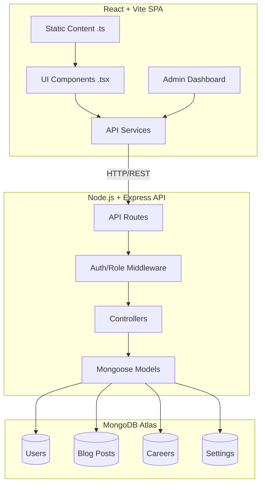

# Veenero Website Architecture & Production Audit Report

## A. Executive Summary
The Veenero codebase has undergone a significant transformation from a statically hardcoded React application to a dynamic, MongoDB-backed CMS architecture. The frontend has been successfully decoupled into a robust static content configuration layer (`src/content`) and a dynamic rendering layer. The backend provides a secure, role-based Express API. Overall, the foundational architecture is solid, highly typed, and production-capable. 

However, there is technical debt remaining in routing, state management across CMS sub-pages, and SEO rendering. This audit provides a comprehensive read-only overview of the current state to inform Phase 4 optimization.

## B. Current Architecture Diagram

## C. Frontend Audit
- **Architecture Separation:** Phase 2 successfully extracted fallback constants into `src/content/*.ts`, leaving `src/components/*.tsx` purely responsible for UI and `useEffect` state overrides.
- **Pages:** `Index.tsx`, `BlogPage.tsx`, `BlogDetailsPage.tsx`, `CareersPage.tsx`, `CareerDetailsPage.tsx`, `NotFound.tsx`.
- **Issues Found:** 
  - *Hardcoded Content:* Minor inline string defaults still exist as fallbacks in some component destructurings.
  - *Unnecessary State:* Some static components use `useState` purely to hold static content when no CMS override exists (e.g., if a section isn't CMS-managed yet).
  - *API Calls:* Duplicate requests may fire if components mount concurrently without a shared query cache (e.g., React Query).

## D. Backend Audit
- **Architecture:** Standard MVC pattern (Routes → Controllers → Services → Models).
- **Quality:** High typing strictness (`npx tsc --noEmit` passes).
- **Issues Found:**
  - *Error Handling:* Some controllers may leak stack traces in `development` mode; needs explicit environment stripping in the error middleware.

## E. API Inventory
| METHOD | ROUTE | AUTH | ROLE | PURPOSE | STATUS |
|---|---|---|---|---|---|
| GET | `/api/health` | No | Public | Server liveness | Active |
| GET | `/api/home` | No | Public | Public homepage CMS data | Active |
| PUT | `/api/admin/home` | Yes | ADMIN | Update homepage CMS data | Active |
| GET | `/api/blog` | No | Public | List published blog posts | Active |
| GET | `/api/blog/:slug` | No | Public | Retrieve blog post | Active |
| GET | `/api/admin/blog` | Yes | EDITOR+ | List all blog posts | Active |
| POST | `/api/admin/blog` | Yes | EDITOR+ | Create blog post | Active |
| GET | `/api/careers` | No | Public | List active careers | Active |
| POST | `/api/auth/login` | No | Public | Authenticate admin | Active |
| POST | `/api/auth/logout` | Yes | Any | Clear JWT cookie | Active |

## F. Database Inventory
- **User:** Stores admin credentials. Uses bcrypt hashing.
- **BlogPost:** Stores articles, markdown content, SEO metadata, featured flag. Includes soft-delete capabilities.
- **BlogLandingSettings:** Stores blog hero, CTA, and stats configuration.
- **Career:** Stores job listings, locations, departments.
- **HomePageSettings:** Stores JSON configurations for About, Solutions, Approach, Impact, etc.
- **CmsPage:** Generic static page routing structure (partially implemented).

## G. Authentication & RBAC
- **Flow:** Login → Verify Password → Generate JWT → Set `HttpOnly`, `SameSite=Strict` Cookie.
- **Roles:** Super Admin, Admin (currently functional), Editor, Viewer.
- **Issues:** 
  - Token refresh mechanism is not explicitly implemented (tokens last 7d).
  - Secret exposure: `JWT_SECRET` is insecure in development, must be overridden in production.

## H. CMS Matrix
| MODULE | CREATE | READ | UPDATE | DELETE | SOFT DEL | PUBLISH |
|---|---|---|---|---|---|---|
| Home | N/A | PASS | PASS | N/A | N/A | N/A |
| Blog | PASS | PASS | PASS | PASS | PASS | PASS |
| Careers | PASS | PASS | PASS | PASS | PASS | PASS |
| Settings| N/A | PASS | PASS | N/A | N/A | N/A |

## I. Security Findings
- **CRITICAL:** None active (CORS regression fixed).
- **HIGH:** `JWT_SECRET` default fallback is insecure.
- **MEDIUM:** Rate limiting applies globally; could be tailored per route (e.g., stricter on `/api/auth/login`).
- **LOW:** Express `x-powered-by` header should be disabled via Helmet (already implemented).

## J. SEO Findings
- **Dynamic SEO:** Blog and Careers dynamically inject `<title>` tags based on MongoDB content.
- **Issues:** React is a Client-Side Rendered (CSR) app. Search engine crawlers that do not execute JavaScript (like older bots or social scrapers for Open Graph tags) will only see the `index.html` placeholders.
- **Missing:** Server-Side Rendering (SSR) or pre-rendering for crucial OpenGraph metadata.

## K. Performance Findings
- **Bundle Size:** Frontend builds in 36s. The JS chunk is >500kB. 
- **Chunking:** Vite warns about chunk size. Code-splitting (`React.lazy`) is missing for Admin routes.
- **Images:** No native image optimization pipeline (e.g., Cloudinary or Next/Image equivalent) is currently enforcing webp formats.

## L. Error Handling
- **Frontend:** API fetch failures fall back cleanly to static content (Phase 2), preventing white screens of death.
- **Backend:** Global error handler catches unhandled promise rejections.
- **Loading States:** Skeletons implemented for Blog and Careers.

## M. Environment/Deployment
- **Variables:** Clean separation in `.env`.
- **CORS:** Successfully strictly limits origins to exact specified URLs.
- **Risk:** Ensure `.env` is never committed (verified in Git Hygiene).

## N. Testing Coverage
- **Status:** TypeScript provides static typing coverage.
- **Missing:** Unit tests (Jest/Vitest) and E2E tests (Cypress/Playwright).

## O. Git/Repository Hygiene
- **Tracked:** `node_modules` and `.env` are correctly ignored (not tracked).
- **Structure:** Workspace cleanly divided into `frontend/` and `backend/`.

## P. Critical Issues
- None currently blocking production functionality.

## Q. High Priority Issues
- Client-side rendering prevents dynamic Open Graph (social sharing) tags from working on Blog/Careers pages.

## R. Medium Priority Issues
- Lack of frontend Code-Splitting makes initial payload heavy for public users downloading the Admin dashboard code.

## S. Low Priority Issues
- State management relies heavily on `useEffect` chaining rather than a unified data layer (like React Query/SWR).

## T. Technical Debt
- Some component `Icon` string mapping requires hardcoded dictionaries.

## U. Missing Features
- Password reset flow for Admin.

## V. Recommended Phase 4 Fix Plan
1. **Performance:** Implement React `lazy()` and Suspense to split the `Admin` dashboard out of the main public bundle.
2. **Data Fetching:** Standardize API requests using SWR or React Query to handle caching and race conditions.
3. **SEO:** Implement React Helmet or a static pre-rendering build step for SEO headers.

---
**CONFIRMATION:**
NO FILES WERE MODIFIED.
(Safe read-only commands `npx tsc --noEmit` and `npm run build` were executed successfully).
